# Uptycs AWS Control Tower Integration

## Prerequisites
You need the following prerequisites to implement the Uptycs AWS Control Tower integration.

- AWS Control Tower with a Landing Zone. For information about setting up an AWS Control Tower landing zone, see [Getting Started with AWS Control Tower in the AWS Control Tower User Guide](https://docs.aws.amazon.com/controltower/latest/userguide/getting-started-with-control-tower.html).
- Administrator privileges in the AWS Control Tower management or delegated account.
- A Uptycs Cloud Security Platform SaaS account.

## Overview
Uptycs delivers a breakdown of your cloud identity risk and governance based on identity types, credentials, activity, and AWS IAM configurations. With Uptycs, security teams are better able to protect your AWS resources from unauthorized access, misuse, and insider threat. Uptycs also provides permission gap analysis and identity mapping to see which assets an identity has access to, which permissions are granted to them, and which are actually being used

https://www.uptycs.com/blog/continuously-monitor-your-cloud-infrastructure-to-improve-cloud-security-posture

## Components
AWS Control Tower provides an integrated solution to set up and govern a secure, multi-account AWS environment. Within Control Tower, landing zones and Account Factory play crucial roles in streamlining the account provisioning and management process. A landing zone serves as a foundation for creating a well-architected, multi-account environment aligned with industry best practices. It establishes a baseline configuration that includes security guardrails, identity and access management policies, network architecture, and logging standards. Landing zones enable organizations to enforce consistent governance and compliance across multiple AWS accounts, facilitating secure and scalable cloud deployments.

Account Factory, on the other hand, complements landing zones by automating the creation and management of AWS accounts at scale. It provides a centralized interface to create new accounts, defining standardized configurations, and applying pre-approved guardrails. This automated process eliminates the manual effort and potential errors involved in setting up individual accounts. Account Factory helps organizations enforce consistent policies, implement security controls, and reduce operational overhead when onboarding new teams or applications. 

Uptycs Customers can now use Account Factory to create accounts and have Uptycs automatically 
integrated into those accounts. 

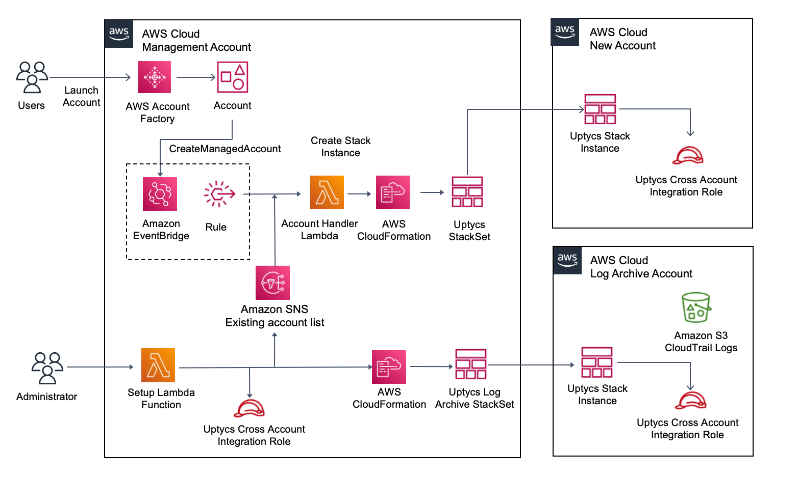

### New Account Automation

1. The creation of a new AWS account via Account Factory creates a Control Tower lifecycle event 
   which triggers the EventBridge rule
2. The EventBridge Rule invokes a Lambda function `uptycs-account-handler.py` processes the 
   message and extracts the account id.
4. The uptycs-account-handler.py Lambda creates a new Uptycs-Integration Stack instance for the 
   account.
5. The Stack instance creates a new Uptycs Cloud Integration cross-account role that permits 
   Uptycs to monitor the account via AWS APIs.

When creating AWS organizations, creating AWS accounts or moving AWS accounts across organizations, ensure that you use the [recommended AWS Control Tower methods](https://docs.aws.amazon.com/controltower/latest/userguide/provision-and-manage-accounts.html). This will ensure that Uptycs monitors the correct AWS accounts. Making updates to AWS accounts outside of AWS Control Tower may cause issues.

## Installing the Uptycs AWS Control Tower Integration

### 1. Generate the Uptycs API Credentials File

Generate a new Uptycs API Credentials file in the Uptycs console.
### Create your Uptycs API credential file
1. Download the API Credentials file from the Uptycs console.  
In your Uptycs Console, navigate to **Settings** -> **Users** -> **Create User** 
Select **Is Bot** and add the **Assets** group to the users
Add the "Admin" permissions to the role or create a custom role
https://cloudint.uptycs.io/help/docs/contents/configuration/system/roles#default-roles
Select **Save**

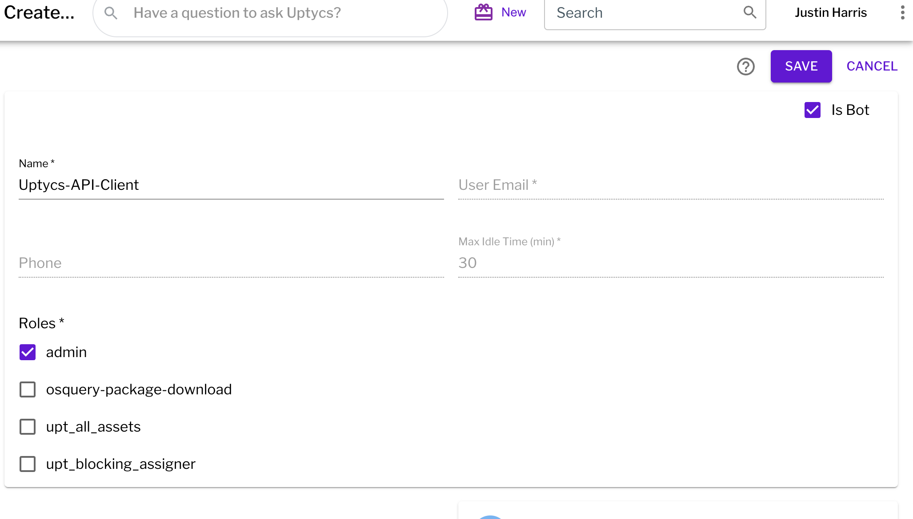

### 2. Login into your AWS Control Tower Management Account

1. Login in to AWS Control Tower management account.
2. Select the AWS region where your AWS Control Tower is deployed.

### 3. Open the API Credentials file to extract the required parameters 

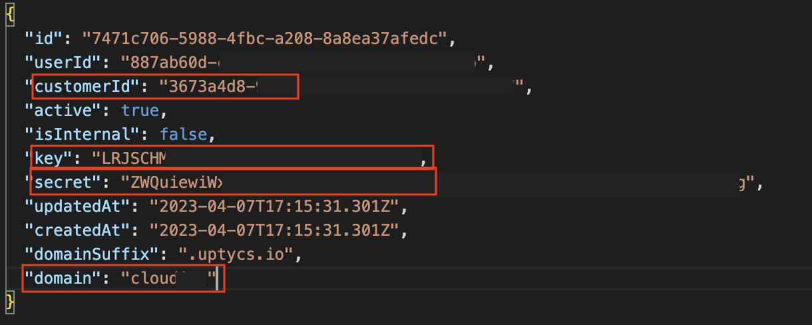

### 4. Deploy the Uptycs AWS Control Tower Integration with CloudFormation

Deploy via the GUI
### Setup Tasks

1. In the master or delegated account load the template **master-acct.yaml**

Go to your CloudFormation console and launch the AWS Control Integration template. The 
template is named `master-account.yaml`.

For most deployments, you only need to enter credentials into the first two sections of the template parameters.

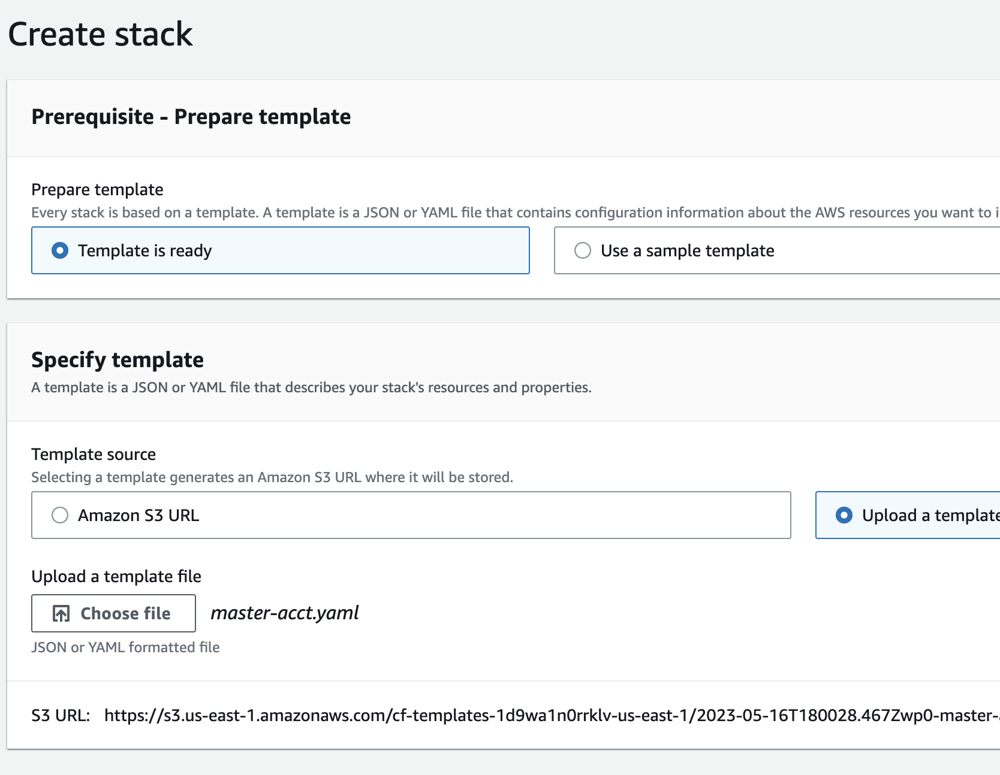

2. Enter the following parameters:
- Enter a **Stack name** for the stack.

Suggested values **Uptycs-Integration-Setup-Stack**

- Enter **Your Uptycs API Key**.
- Enter **Your Uptycs API Secret**.
- Enter **Your Uptycs API CustomerID**.
- Enter **Your Uptycs API Domain**
- Enter **Your Uptycs API Domain Suffix**

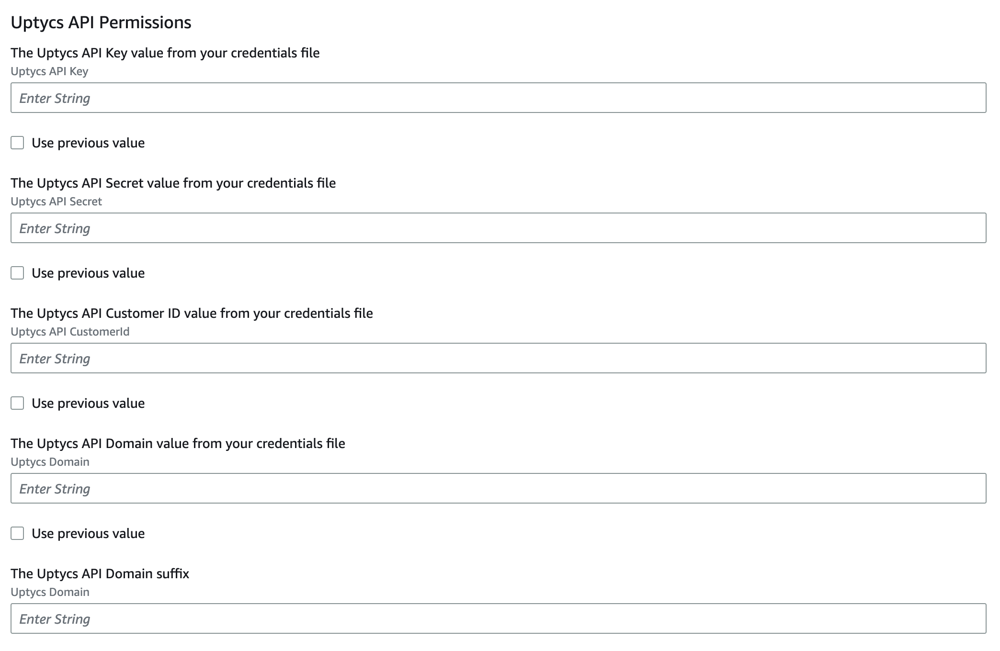
 

- Enter **cloudtrail bucket name** from your Log Archive account
- Enter **cloudtrail bucket name** from your Log Archive account
- Enter **cloudtrail bucket region** from your Log Archive account
- Enter **cloudtrail log prefix** if your cloudtrail has a log prefix.
- Enter **SSE-KMS** the KMS key ARN if using KMS keys to encrypt cloudtrail logs

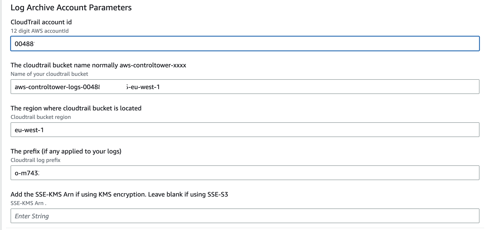

#### Optional Parameters
| Parameter Name               | Description                                                                                                                                                                                                                                                                       | Default Value                 |
|------------------------------|-----------------------------------------------------------------------------------------------------------------------------------------------------------------------------------------------------------------------------------------------------------------------------------|-------------------------------|
| UptycsKeysParameterStoreName | The parameter store name for the API keys in systems manager                                                                                                                                                                                                                      | /uptycs                       |
| S3BucketName                 | Uptycs hosts the lambda source files in an s3 bucket. The files are copied to a local s3 bucket before the template is created. Change this if you wish to host the files yourself.                                                                                               | uptycs-cloud-integrations-test |
| UptycsStackSetName           | The name of the CFT StackSet that will be created in the master account.                                                                                                                                                                                                          | Uptycs-Integration-StackSet   |
| ExistingAccounts             | Setting this value to yes initiates a function within uptycs-setup.py that creates a stack instance in every account currently under management by Control tower with the exception of the log archive account.                                                                   | No                            | 
| KMSKeyArn                    | If you are using KMS keys to encrypt your cloudtrail logs the log archive account template will include an IAM role to access the cloudtrail logs with a KMS key policy included.  If you are not the IAM role will simply contain rules to allow access to the bucket log files. | None |
| PermissionsBoundary| Set the name of the permissions boundary name if you require a permissions boundary policy to be added to your IAM roles.                                                                                                                                                         | None|

### 5. Validate the Uptycs AWS Control Tower Integration

#### Verify Stack Creation

Verify that two Stacks are created.  Your orginal stack and the **Uptycs-Integration** stack
 
  
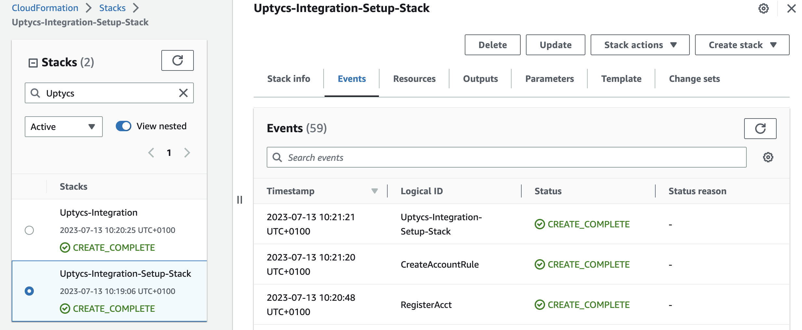

#### Verify StackSet Creation 

Verify that two StackSets have been created.

- Uptycs-Log-Integration-StackSet
- Uptycs-Integration-StackSet

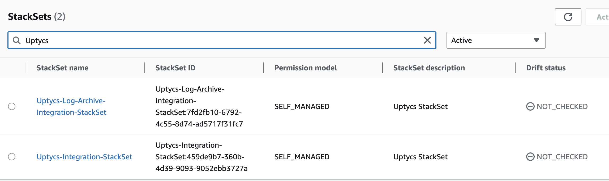

2. Verify that the Log Archive Account has a new Stack Instance from the Log Archive Stackset
   

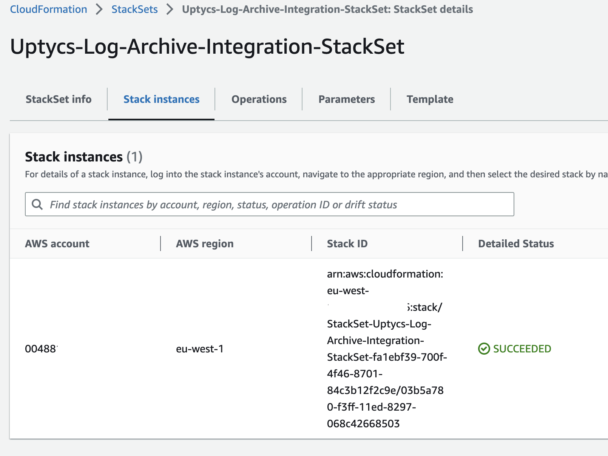

## Resources Created
The template creates the resources shown in the diagram above.  There are two lambda 
functions that perform the majority of the setup. 

### Lambda 'uptycs-setup.py'
The `uptycs-setup.py` lambda function performs the following tasks
   - Creates a SNS topic that is used for StackSet management
   - Creates the `uptycs-account-handler.py' lambda function that subscribes to the SNS topic 
     that handles StackSet Management
   - Creates a StackSet that should be applied to all member accounts with the exception of the 
     "Log Archive" account **Uptycs-Integration-StackSet**

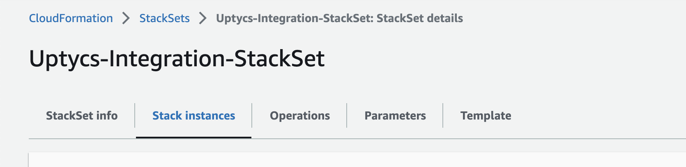

   - Creates a StackSet that is automatically applied to the "Log Archive" account **Uptycs-Log-Archive-Integration-StackSet**

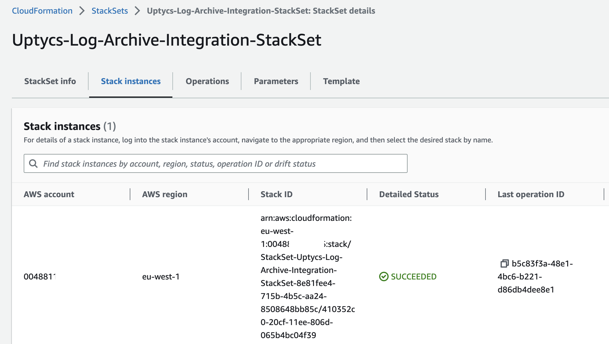

   - (If the parameter ExistingAccounts is set to Yes) Generates a list of accounts that the **Uptycs-Integration-StackSet** 
     accounts StackSet will be applied to and sends a message to the SNS topic

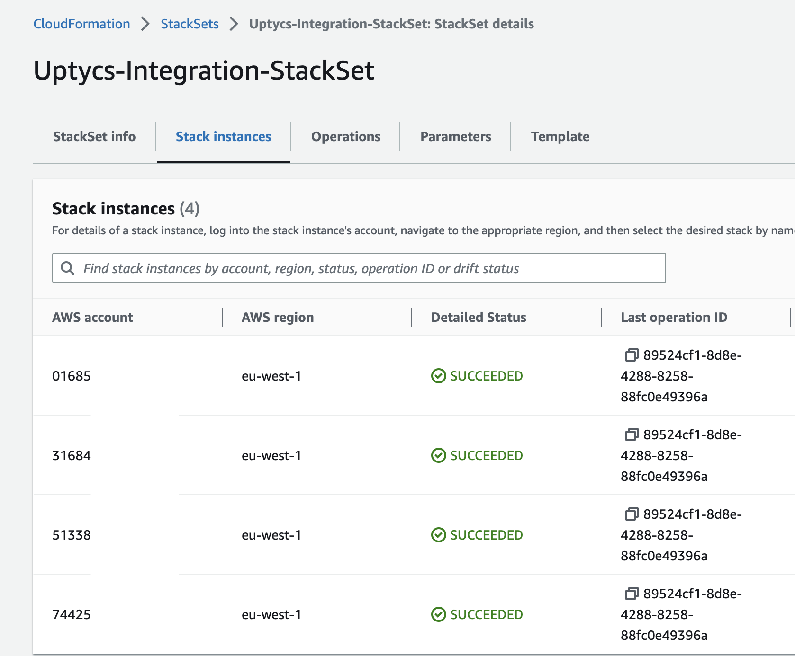

   - Creates an EventBridge rule that filters on a `CreateManagedAccount` or 
     `UpdateManagedAccount` event and triggers the `uptycs-account-handler.py` lambda function

## Deletion

Before running the delete the cloudformation stack you will need to remove any current stack 
instances from the following stacksets

**Uptycs-Integration-StackSet**

**Uptycs-Log-Archive-Integration-StackSet**

You should also delete the **Uptycs-Integration** stack