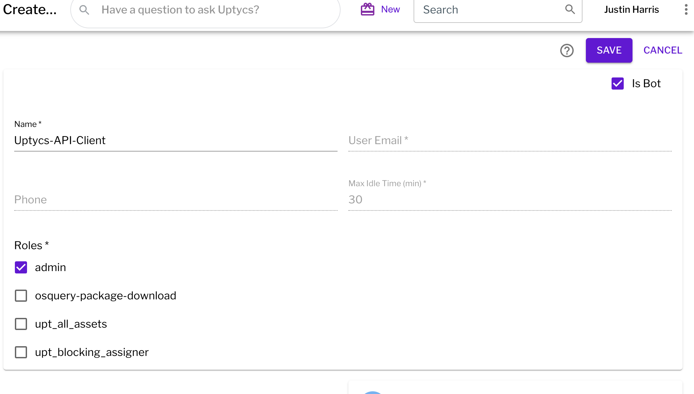
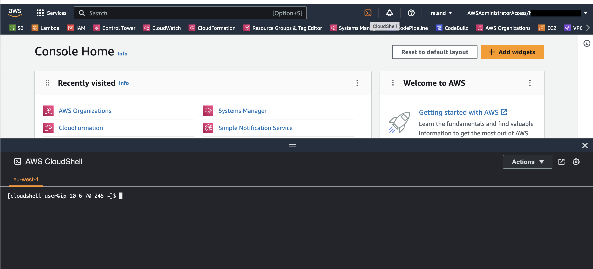
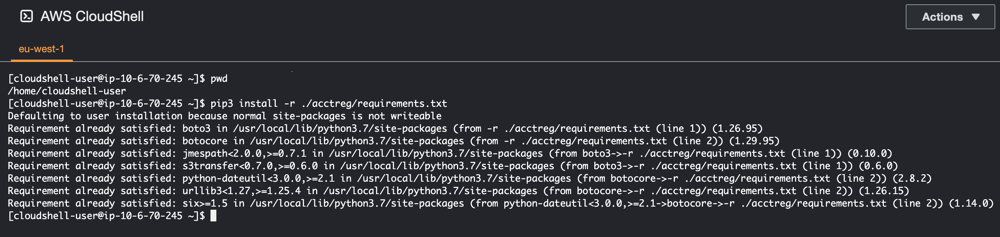
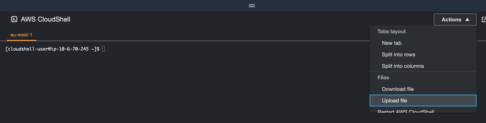
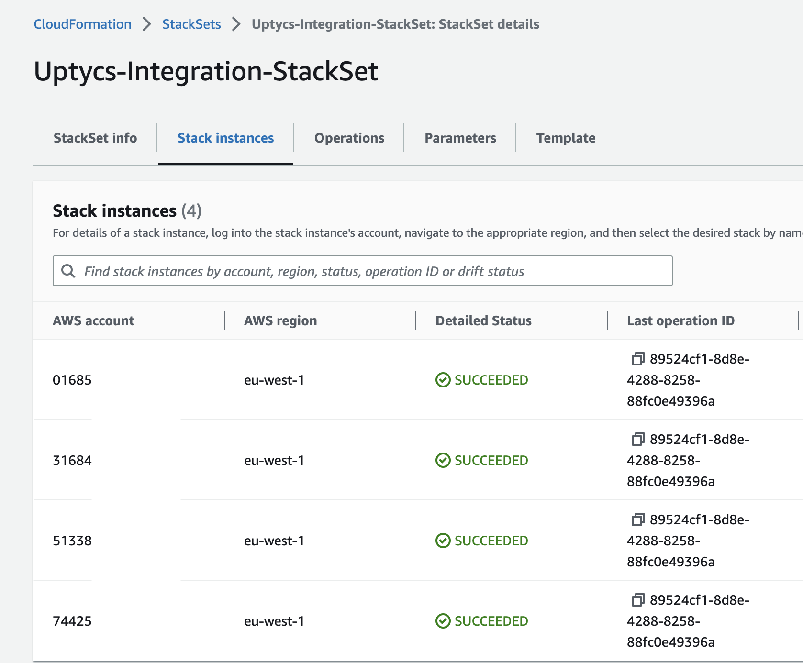
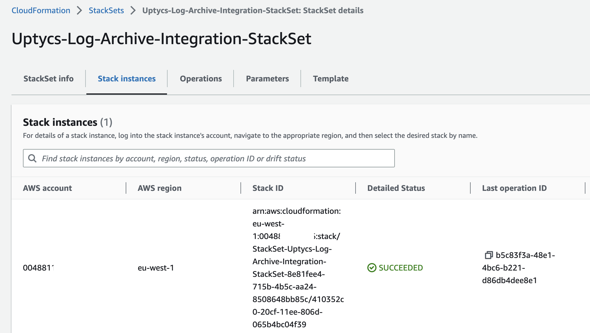

# Uptycs CSPM setup

A collection of scripts to help with setting up Uptycs CSPM

## AWS Control Tower Setup

The script is designed to help with setup of Uptycs CSPM in a Control Tower environment. 

See [Control Tower](./Documentation/aws-control-tower/README.md) for more information

## Prerequisites

### Create your Uptycs API credential file
In your Uptycs Console, navigate to **Settings** -> **Users** -> **Create User** 
Select **Is Bot** and add the **Assets** group to the users
Add the "Admin" permissions to the role or create a custom role
https://cloudint.uptycs.io/help/docs/contents/configuration/system/roles#default-roles
Select **Save**





### Create the CloudShell environment

Open a CloudShell environment in the region where you have ControlTower Setup





### Install Required Python Modules

```text
pip3 install -r ./acctreg/requirements.txt
```



### Clone the repository

```text
git clone https://github.com/jharris-uptycs/acctreg.git
```


### Upload the API Credentials File





### Move the file to the acctreg directory

```text
mv <api-key-file> ./acctreg
```

### Change  acctreg directory

```text
cd ./acctreg
```


## Usage

[!NOTE]  
Execute the commands from the acctreg directory


```
$ python3 setup_cft_org.py -h
usage: setup_cft_org.py [-h] --action {Check,Create,Delete} --config CONFIG
                        [--rolename ROLENAME] [--ctaccount CTACCOUNT]
                        [--ctbucket CTBUCKET] [--ctprefix CTPREFIX]
                        [--ctregion CTREGION] [--permboundary PERMBOUNDARY]
                        [--existingaccts {Yes,No}]

Creates a cloudformation template to Integrate Uptycs with this account

optional arguments:
  -h, --help            show this help message and exit
  --action {Check,Create,Delete}
                        The action to perform: Check, Create, or Delete
  --config CONFIG       REQUIRED: The path to your auth config file downloaded
                        from Uptycs console
  --rolename ROLENAME   OPTIONAL: The Name of the IAM role that you will
                        create
  --ctaccount CTACCOUNT
                        Cloudtrail account
  --ctbucket CTBUCKET   The Name of the CloudTrail bucket
  --ctprefix CTPREFIX   The CloudTrail log prefix
  --ctregion CTREGION   The Name of the CloudTrail bucket region
  --permboundary PERMBOUNDARY
                        OPTIONAL: Permissions boundary policy to apply to the
                        role
  --existingaccts {Yes,No}
                        OPTIONAL: Apply the Role to existing accounts
```

## CloudTrail implementation in ControlTower
In AWS Control Tower releases before landing zone version 3.0, AWS Control Tower created a member 
account trail in each account. When you update to release 3.0, your CloudTrail trail becomes an 
organization trail. Customers who have not upgraded to an organization wide trail will not have an
org wide trail in the master account.  The script will try to determine if the org wide trail exists
and will output the relevant CloudTrail parameters if the trail exists.   For customers running 
release <3.0 you will need to examine the logging account to extract the relevant cloudtrail data.

The script has three actions 

## Running the Script

1) Perform Checks `--action Check`

The check function currently performs the following checks
- Checks for the required template file
- Checks for a valid api credentials file
- Checks that an existing stack does not exist in the account (Ensures that this org is not 
already registered)
- Looks for a valid cloudtrail configuration in the master account (as described above).

```
python3 setup_cft_org.py --config <path_to_api_config_file> --action check
```

Sample output
```
$ python3 setup_cft_org.py --config apikey.json --action Check

Checking for required files....
File 'apikey.json' found.
File './cloudformation/master-acct.json' found.

Checking for existing setup....
The stack uptycs-ct-master already exists... you should delete the existing stack first 

Looking for a suitable CloudTrail.....
Found an existing org wide trail in this account.....

You can use these values for CloudTrail in the script
--ctaccount 004881111xxx --ctbucket aws-controltower-logs-004881111xxx-eu-west-1 --ctprefix 
o-m74320exxx --ctregion eu-west-1
```


2) Register Orgnanization `--action Create`

The script performs the following 
- Checks for the required template file
- Checks for a valid api credentials file
- Checks the stack does not exist
- Loads the cloudformation stack

**Mandatory arguments**

--config <path_to_api_config_file> 
--action Create 
--ctaccount <log_archive_account_number> 
--ctbucket <cloudtrail_bucket> 
--ctprefix <cloudtrail_log_prefix> 
--ctregion <cloudtrail_region

**Optional arguments**

--rolename <Uptycs_rolename>
--permboundary <permissions_boundary_policy_name>
--existingaccts <apply_IAM_Role_to_existing_accounts>
--
```
python3 setup_cft_org.py --config <path_to_api_config_file> --action Create --ctaccount 
<log_archive_account_number> --ctbucket <cloudtrail_bucket> --ctprefix <cloudtrail_log_prefix> 
--ctregion <cloudtrail_region
```

3)  Delete Registation

Before running the delete option you will need to remove any current stack instances from the 
following stacksets

**Uptycs-Integration-StackSet**



**Uptycs-Log-Archive-Integration-StackSet**



```
python3 setup_cft_org.py --config <path_to_api_config_file> --action Delete
```

Delete the cloudformation stack `

**Uptycs-Integration**

Finally run the following command
```
python3 setup_cft_org.py --config <path_to_api_config_file> --action Delete
```


